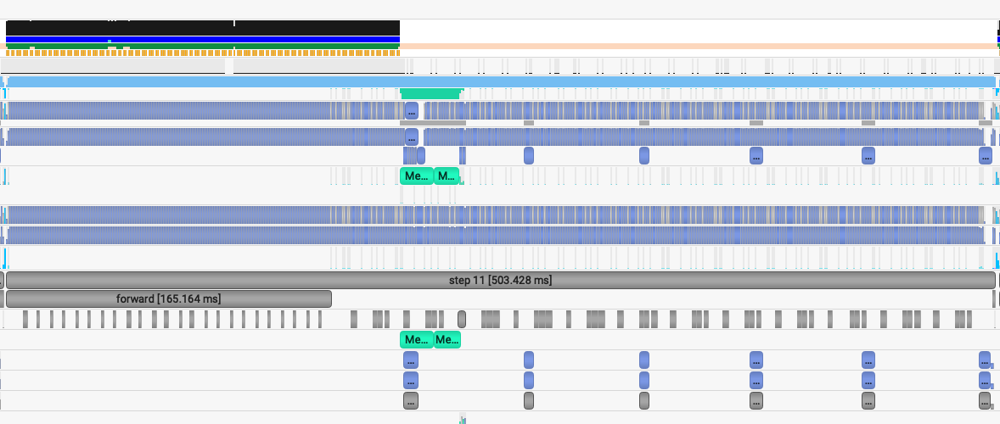
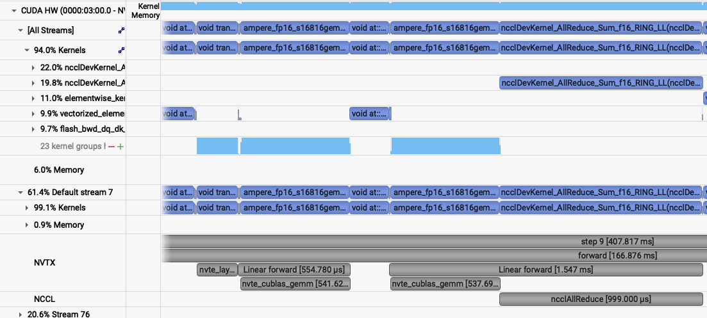

# SC25 Deep Learning at Scale Tutorial

This repository contains the example code material for the SC25 tutorial:
*Deep Learning at Scale*.

**Contents**
* [Links](#links)
* [Installation](#installation-and-setup)
* [Model, data, and code overview](#model-data-and-training-code-overview)
* [Single GPU training](#single-gpu-training)
* [Single GPU performance](#single-gpu-performance-profiling-and-optimization)
* [Distributed training with data parallelism](#distributed-training-with-data-parallelism)
* [Multi-GPU model parallelism](#model-parallelism)

## Links

Tutorial slides: https://drive.google.com/drive/folders/10sUC4RK98DlapVuPPekcjysOnYgEUn_Z?usp=sharing

Join the Slack workspace: https://join.slack.com/t/nersc-dl-tutorial/shared_invite/zt-3icqbsg2e-ZaYsHXdMs~rpt6b_2yw6gQ

NERSC JupyterHub: https://jupyter.nersc.gov

Data download (only needed if you want to run our examples elsewhere): https://portal.nersc.gov/project/dasrepo/pharring/sc23_data

## Installation and Setup

### Software environment

The instructions in this README are intended to be used with the alternative NVIDIA DLI resources available the day of this tutorial.

Please reach out to the instructors for instructions on how to access this resource.

### Installing Nsight Systems
In this tutorial, we will be generating profile files using NVIDIA Nsight Systems on the remote systems. In order to open and view these
files on your local computer, you will need to install the Nsight Systems program, which you can download [here](https://developer.nvidia.com/gameworksdownload#?search=nsight%20systems). Select the download option required for your system (e.g. Mac OS host for MacOS, Window Host for Windows, or Linux Host .rpm/.deb/.run for Linux). You may need to sign up and create a login to NVIDIA's developer program if you do not
already have an account to access the download. Proceed to run and install the program using your selected installation method.

## Model, data, and training code overview

The model in this repository is adapted from modern applications of deep learning for weather forecasting, e.g. [FourCastNet](https://arxiv.org/abs/2202.11214), [GraphCast](https://arxiv.org/abs/2212.12794), [Pangu-Weather](https://arxiv.org/abs/2211.02556), and others. These models are trained on a combination of observed and simulated data describing the atmospheric state on Earth over the past several decades, and they achieve impressive performance in terms of accuracy and forecast speed when compared against traditional numerical weather prediction (NWP) models.


For these examples we will be using a [vision transformer](https://arxiv.org/abs/2010.11929) (ViT) architecture, for which our implementation can be found in [`networks/vit.py`](networks/vit.py). ViTs are a widely-used architecture in computer vision, known for scaling well to large datasets and being able to model long-range dependencies easily via the use of self-attention layers. While 'vanilla' ViTs are not necessarily state-of-the-art on the weather forecasting task, they are a good model to use for educational purposes as they are widely used in a variety of applications and the techniques outlined here (e.g. channel-wise tensor parallelism) would transfer well to other applications (e.g. NLP/LLMs).


Data-driven weather models are typically trained on the [ERA5 reanalysis dataset](https://www.ecmwf.int/en/forecasts/dataset/ecmwf-reanalysis-v5) from the European Center for Medium-range Weather Forecasts (ECMWF). This dataset represents 40 years of atmospheric data on a 25km global grid, combining simulation outputs assimilated with observations. The basic data loading pipeline for training models is defined in [`utils/data_loader.py`](utils/data_loader.py), whose primary components are:
* The `ERA5Dataset`, which accesses the data stored on disk and serves input-output pairs of the atmospheric variables for training and validation. Each pair is a randomly-sampled snapshots of the atmosphere, separated by a 6 hour timestep. The model is given the first snapshot as input and is trained to predict the snapshot 6 hours later.
* For this repository, we will be using a spatially-downsampled version of the data so training runs a little faster.
* The above dataset object is passed to a PyTorch `DataLoader` which takes the samples and combines them into a batch for each training step.

It is common practice to decay the learning rate according to some schedule as the model trains, so that the optimizer can settle into sharper minima during gradient descent. Here we opt for the cosine learning rate decay schedule, which starts at an intial learning rate and decays continuously throughout training according to a cosine function. This is handled by the `LambdaLR` or `CosineAnnealingLR` utilities from PyTorch, set in [`train.py`](train.py) -- the `LambdaLR` uses custom logic to implement learning rate warm-up if desired for distributed training.

As we will see in the [Single GPU performance profiling and optimization](#Single-GPU-performance-profiling-and-optimization) section, we'll be able to speed up the baseline data loading pipeline significantly by making various improvements. Another option introduced in that section is to do data loading using NVIDIA's DALI library, for which the implementation can be found in [`utils/data_loader_dali.py`](utils/data_loader_dali.py).

The script to train the model is [`train.py`](train.py), which uses the following arguments to load the desired training setup:
```
--yaml_config YAML_CONFIG   path to yaml file containing training configs
--config CONFIG             name of desired config in yaml file
```

Based on the selected configuration, the train script will then:
1.  Set up the data loaders and construct our ViT model, the Adam optimizer, and our L2 loss function.
2.  Loop over training epochs to run the training. See if you can identify the following key components: 
    * Looping over data batches from our data loader.
    * Applying the forward pass of the model and computing the loss function.
    * Calling `backward()` on the loss value to backpropagate gradients. Note the use of the `grad_scaler` will be explained below when enabling mixed precision.
    * Applying the model to the validation dataset and logging training and validation metrics to visualize in TensorBoard (see if you can find where we construct the TensorBoard `SummaryWriter` and where our specific metrics are logged via the `add_scalar` call).

More info on the model and data can be found in the [slides](https://drive.google.com/drive/folders/10sUC4RK98DlapVuPPekcjysOnYgEUn_Z?usp=sharing). If you are experimenting with this repository after the tutorial date, you can download the data from here: https://portal.nersc.gov/project/dasrepo/pharring/sc23_data.
Note that you will have to adjust the data path in `submit_pm.sh` to point your personal copy after downloading.

## Single GPU training

First, let us look at the performance of the training script without optimizations on a single GPU.

To submit this job, use the following command:
```
./submit_dli.sh --config=short
```
Note that any arguments for `train.py`, such as the desired config (`--config`), can be added after `submit_dli.sh` when submitting, and they will be passed to `train.py` properly.

This will run 128 training iterations on a single GPU using a default batch size of 16.
See [`config/ViT.yaml`](config/ViT.yaml) for specific configuration details.
Note we will use the default batch size for the optimization work in the next section
and will push beyond to larger batch sizes in the distributed training section.

While the model predicts many atmospheric variables, we will focus on the prediction error of surface wind at 10m `u10` to represent model quality.
In the baseline configuration, the model converges to a u10 RMSE of about `0.13` on
the validation dataset in about 22k training iterations. This takes around 22 hours hours to run, so to save time we have already included an example TensorBoard log for the `base` config in the `example_logs` directory for you.
Note that, to run this, you would submit your job with `--config=base`.
We want to compare our training results against the `base` config baseline, and TensorBoard makes this easy as long as all training runs are stored in the same place. 
To copy the example TensorBoard log to the scratch directory where our training jobs will output their logs, do
```
cp -r ./example_logs/base /dli/task/logs
```

This scratch directory will serve as our log directory (all results including profiles will be written here). To view results in TensorBoard, open the [`start_tensorboard_dli.ipynb`](start_tensorboard_dli.ipynb) notebook and follow the instructions in it to launch a TensorBoard session in your browser. Once you have TensorBoard open, you should see a dashboard with data for the loss values, learning rate, and average iterations per second. Looking at the validation loss for the `base` config, you should see the following training curve:


As our training with the `short` config runs, it should also dump the training metrics to the TensorBoard directory, and TensorBoard will parse the data and display it for you. You can hit the refresh button in the upper-right corner of TensorBoard to update the plots with the latest data.

## Single GPU performance profiling and optimization

This is the performance of the baseline script for the first three epochs on a 94GB H100 NVL card with batch size 16 using the `short` config, which limits the number of training and validation samples to 512 and 128 samples respectively:
```
2025-11-13 21:35:55,423 - root - INFO - Time taken for epoch 1 is 79.249300 sec, avg 6.460625 samples/sec
2025-11-13 21:35:55,425 - root - INFO -   Avg train loss=0.579433
2025-11-13 21:36:07,259 - root - INFO -   Avg val loss=0.42868003249168396
2025-11-13 21:36:07,260 - root - INFO -   Total validation time: 11.2812340259552 sec
2025-11-13 21:36:47,277 - root - INFO - Time taken for epoch 2 is 39.997329 sec, avg 12.800855 samples/sec
2025-11-13 21:36:47,277 - root - INFO -   Avg train loss=0.396084
2025-11-13 21:36:50,967 - root - INFO -   Avg val loss=0.375538170337677
2025-11-13 21:36:50,967 - root - INFO -   Total validation time: 3.13576340675354 sec
2025-11-13 21:37:31,451 - root - INFO - Time taken for epoch 3 is 40.464699 sec, avg 12.653004 samples/sec
2025-11-13 21:37:31,452 - root - INFO -   Avg train loss=0.361612
2025-11-13 21:37:35,140 - root - INFO -   Avg val loss=0.35445573925971985
2025-11-13 21:37:35,140 - root - INFO -   Total validation time: 3.123826503753662 sec
2025-11-13 21:38:15,974 - root - INFO - Time taken for epoch 4 is 40.814237 sec, avg 12.544642 samples/sec
2025-11-13 21:38:15,975 - root - INFO -   Avg train loss=0.350011
2025-11-13 21:38:19,655 - root - INFO -   Avg val loss=0.35050657391548157
2025-11-13 21:38:19,655 - root - INFO -   Total validation time: 3.1182711124420166 sec
2025-11-13 21:38:19,684 - root - INFO - DONE ---- rank 0
```
After the first epoch, we see that the throughput achieved is about 12.5 samples/s.

### Profiling with Nsight Systems
#### Adding NVTX ranges and profiler controls
Before generating a profile with Nsight, we can add NVTX ranges to the script to add context to the produced timeline.
We can add some manually defined NVTX ranges to the code using `torch.cuda.nvtx.range_push` and `torch.cuda.nvtx.range_pop`.
We can also add calls to `torch.cuda.profiler.start()` and `torch.cuda.profiler.stop()` to control the duration of the profiling
(e.g., limit profiling to single epoch). You can `grep` through `train.py` for these API calls to see what we've added in this example.

To generate a profile using our scripts, run the following command:
```
ENABLE_PROFILING=1 PROFILE_OUTPUT=baseline-dli ./submit_dli.sh --config=short
```
This command will run four epochs of the training script, profiling only the last epoch run. It will produce a file `baseline-dli.nsys-rep` that can be opened in the Nsight System's program. The arg `--trace=cuda,nvtx` is optional and is used here to disable OS Runtime tracing for speed. The arg `-c cudaProfilerApi` instructs the profiler to only profile the duration of the runtime between the `torch.cuda.profiler.start()` and `torch.cuda.profiler.stop()` calls.

To view the profile, download (copy) the generated profile (this will be in your log directory in your scratch) to your local computer and open it in Nsight Systems.
Loading this profile ([`baseline.nsys-rep`](sample_nsys_profiles/baseline.nsys-rep)) in Nsight Systems will look like this:


From this zoomed out view, we can see some idle gaps between training iterations. These gaps are due to the data loading, which we will address in the next section.

Beyond this, we can zoom into a single iteration and get an idea of where compute time is being spent:


### Data loading optimizations
#### Improving the native PyTorch dataloader performance
The PyTorch dataloader has several knobs we can adjust to improve performance. If you look at the `DataLoader` initialization in
`utils/data_loader.py`, you'll see we've already set several useful options, like `pin_memory` and `persistent_workers`.
`pin_memory` has the data loader read input data into pinned host memory, which typically yields better host-to-device and device-to-host
memcopy bandwidth. `persistent_workers` allows PyTorch to reuse workers between epochs, instead of the default behavior which is to
respawn them. One knob we've left to adjust is the `num_workers` argument, which we can control via the `--num_data_workers` command
line arg to our script. The default used by PyTorch is `num_workers=0`, which runs data loading *sequentially* in the training Python process. This is one source of the large gaps we observed in the first profile. By setting `num_workers>0`, we enable PyTorch to use multiprocessing to perform data loading in a side process to hide this cost. We can experiment with the number of workers to see if performance is improved.

We can run this experiment by running the following command:
```
./submit_dli.sh --config=short --num_data_workers <value of your choice>
```

For example:

```
ENABLE_PROFILING=1 PROFILE_OUTPUT=baseline-dli_dw8 ./submit_dli.sh --config=short --num_data_workers 8 --run_num=nw8
```

You can use the `run_num` argument to further sub-tag the same configuration. Here, we used `run_num=nw8`.

This is the performance of the training script for the first three epochs with batch size 16 and 8 data workers:
```
2025-11-13 22:42:09,548 - root - INFO - Time taken for epoch 1 is 33.328508 sec, avg 15.362224 samples/sec
2025-11-13 22:42:09,548 - root - INFO -   Avg train loss=0.577852
2025-11-13 22:42:13,377 - root - INFO -   Avg val loss=0.42784014344215393
2025-11-13 22:42:13,378 - root - INFO -   Total validation time: 3.305051803588867 sec
2025-11-13 22:42:44,084 - root - INFO - Time taken for epoch 2 is 30.704325 sec, avg 16.675175 samples/sec
2025-11-13 22:42:44,084 - root - INFO -   Avg train loss=0.396532
2025-11-13 22:42:48,309 - root - INFO -   Avg val loss=0.37536969780921936
2025-11-13 22:42:48,310 - root - INFO -   Total validation time: 3.703903913497925 sec
2025-11-13 22:43:19,734 - root - INFO - Time taken for epoch 3 is 31.423005 sec, avg 16.293795 samples/sec
2025-11-13 22:43:19,734 - root - INFO -   Avg train loss=0.362079
2025-11-13 22:43:24,667 - root - INFO -   Avg val loss=0.35496950149536133
2025-11-13 22:43:24,667 - root - INFO -   Total validation time: 4.411658048629761 sec
```

Increasing the number of workers to 8 improves throughput to around 16 samples per second. You can play around with this number but typically 2 - 8 gives you good performance. At some point, you will hit diminishing returns and performance will start to degrade.

We can run the 8 worker configuration through profiler using the instructions in the previous section with the added `--num_data_workers`
argument and load that profile in Nsight Systems. This is what this profile ([`baseline_dw8.nsys-rep`](sample_nsys_profiles/baseline_dw8.nsys-rep)) looks like:


and zoomed in:


With 4 or 8 data workers, the idle gaps between steps are resolved, improving the throughput. Looking at the zoomed in profile, we
still see that the H2D copy in of the input data (i.e. the light green activity at the beginning of the step) takes some time and runs in same CUDA stream as the compute. One option here is to implement a prefetching
mechanism in PyTorch directly using CUDA streams to concurrently load and copy in the next batch of input during the current batch, however
this is left as an exercise outside of this tutorial. A good example of this can be found in [here](https://github.com/NVIDIA/DeepLearningExamples/blob/41f582bd9f65f6ebede77532b7cd64f038a8a380/PyTorch/Classification/ConvNets/image_classification/dataloaders.py#L354)

#### Using NVIDIA DALI
While we were able to get more performance out of the PyTorch native DataLoader, there are several potential overheads we cannot overcome in
PyTorch alone:
1. The PyTorch DataLoader will use CPU operations for all I/O operations as well as data augmentations
2. The PyTorch DataLoader uses multi-processing to spawn data workers, which has performance overheads compared to true threads

The NVIDIA DALI library is a data loading library that can address both of these points:
1. DALI can perform a wide array of data augmentation operations on the GPU, benefitting from acceleration relative to the CPU.
2. DALI maintains its own worker threads in the C++ backend, enabling much more performant threading and concurrent operation.

For this tutorial, we've provided an alternative data loader using DALI to accelerate the data augmentations used in this training script that can be found in `utils/data_loader_dali.py`. This data loader is enabled via the command line
argument `--data_loader_config=dali` to the training script.

We can run this experiment using DALI with 8 worker threads by running the following command:
```
ENABLE_PROFILING=1 PROFILE_OUTPUT=baseline-dli_dw8_dali ./submit_dli.sh --config=short --num_data_workers 8 --data_loader_config=dali --run_num=nw8_dali
```

This is the performance of with DALI and 8 data workers:
```
2025-11-13 22:49:51,424 - root - INFO - Time taken for epoch 1 is 27.449957 sec, avg 18.069245 samples/sec
2025-11-13 22:49:51,425 - root - INFO -   Avg train loss=0.586527
2025-11-13 22:49:53,784 - root - INFO -   Avg val loss=0.43451911211013794
2025-11-13 22:49:53,784 - root - INFO -   Total validation time: 1.6329052448272705 sec
2025-11-13 22:50:22,346 - root - INFO - Time taken for epoch 2 is 28.561237 sec, avg 17.926395 samples/sec
2025-11-13 22:50:22,347 - root - INFO -   Avg train loss=0.400770
2025-11-13 22:50:24,999 - root - INFO -   Avg val loss=0.3789120018482208
2025-11-13 22:50:24,999 - root - INFO -   Total validation time: 1.634108066558838 sec
2025-11-13 22:50:54,252 - root - INFO - Time taken for epoch 3 is 29.251695 sec, avg 17.503259 samples/sec
2025-11-13 22:50:54,253 - root - INFO -   Avg train loss=0.363414
2025-11-13 22:50:56,955 - root - INFO -   Avg val loss=0.3558248281478882
2025-11-13 22:50:56,956 - root - INFO -   Total validation time: 1.629340648651123 sec
```

We can run the DALI case through profiler using the instructions in the earlier section with the added `--data_loader_config=dali`
argument and load that profile in Nsight Systems. This is what this profile ([`baseline_dw8_dali.nsys-rep`](sample_nsys_profiles/baseline_dw8_dali.nsys-rep)) looks like and zoomed in to a single iteration:


With DALI, you will see that there are now multiple CUDA stream rows in the timeline view, corresponding to internal streams DALI uses
to run data augmentation kernels and any memory movement concurrently with the existing PyTorch compute kernels. Stream 13 in this view shows concurrent H2D memory copies of the batch input data, which is an improvement over the native dataloader.

### Enabling Mixed Precision Training
Now that the data loading performance has been improved, we can start focusing on pushing compute performance. As a first step to improve the compute performance of this training script, we can enable automatic mixed precision (AMP) in PyTorch. AMP provides a simple way for users to convert existing FP32 training scripts to mixed FP32/FP16 of FP32/BF16 precision, unlocking
faster computation with Tensor Cores on NVIDIA GPUs.

The AMP module in torch is composed of two main parts: `torch.cuda.amp.GradScaler` and `torch.cuda.amp.autocast`. `torch.cuda.amp.GradScaler` handles automatic loss scaling to control the range of FP16 gradients when using FP16 precision. Note that since BF16 precision maintains the range of FP32, loss scaling is not required when using AMP with this data type.
The `torch.cuda.amp.autocast` context manager handles converting model operations to BF16/FP16 where appropriate.

As a quick note, the H100 GPUs we've been using to report results thus far have been able to benefit from Tensor Core compute via the use of TF32 precision operations, enabled by default for CUDNN and CUBLAS in PyTorch. You may measure the benefit of TF32 precision usage on the H100 GPU by temporarily disabling it via setting the environment variable `NVIDIA_TF32_OVERRIDE=0`. We will leave that to you as an exercise. You should see slower performance when TF32 is disabled.

Though TF32 helps, AMP can still provide more performance improvement for H100 GPUs,
as TF32 is a compute type only, leaving all data in full precision FP32. FP16 precision has the compute benefits of Tensor Cores combined with a reduction in storage and memory bandwidth requirements. 

You can turn on AMP with `--amp_mode=fp16` or `--amp_mode=bf16`. Let's do it for BF16.

We can run this experiment using AMP by running the following command:
```
ENABLE_PROFILING=1 PROFILE_OUTPUT=baseline-dli_dw8_dali_bf16 ./submit_dli.sh --config=short --num_data_workers 8 --data_loader_config=dali --amp_mode=bf16 --run_num=nw8_dali_bf16
```


This is the performance with batch size 16, 8 workers, DALI, and AMP BF16:
```
2025-11-13 22:57:46,895 - root - INFO - Time taken for epoch 1 is 5.987096 sec, avg 82.844844 samples/sec
2025-11-13 22:57:46,896 - root - INFO -   Avg train loss=0.583240
2025-11-13 22:57:48,215 - root - INFO -   Avg val loss=0.43116989731788635
2025-11-13 22:57:48,215 - root - INFO -   Total validation time: 1.0079138278961182 sec
2025-11-13 22:57:53,210 - root - INFO - Time taken for epoch 2 is 4.994217 sec, avg 102.518575 samples/sec
2025-11-13 22:57:53,210 - root - INFO -   Avg train loss=0.399165
2025-11-13 22:57:54,033 - root - INFO -   Avg val loss=0.3795023560523987
2025-11-13 22:57:54,033 - root - INFO -   Total validation time: 0.5124382972717285 sec
2025-11-13 22:57:59,085 - root - INFO - Time taken for epoch 3 is 5.051072 sec, avg 101.364614 samples/sec
2025-11-13 22:57:59,085 - root - INFO -   Avg train loss=0.363820
2025-11-13 22:57:59,863 - root - INFO -   Avg val loss=0.35601258277893066
2025-11-13 22:57:59,863 - root - INFO -   Total validation time: 0.47336769104003906 sec
```

For this model, we see a massive improvement when using AMP with either FP16 or BF16 precision, improving throughput to over 100 samples/s in each case. BF16 may have a slight edge over FP16 due to the lack of loss scaling.

For the saved profile: This is ([`baseline_dw8_dali_bf16.nsys-rep`](sample_nsys_profiles/baseline_dw8_dali_bf16.nsys-rep)) looks like:


With AMP enabled, we see that the `forward` (and, correspondingly the backward) time is significantly reduced. The transformer
architecture we are using relies mainly on GEMM operations that greatly benefit from mixed precision.

### Just-in-time (JIT) compilation via `torch.compile` and fused optimizers
While AMP provided a large increase in compute speed already, there are a few other optimizations available for PyTorch to improve
compute throughput. A first (and simple change) is to enable the `fused` option in the Adam optimizer from `torch.optim.Adam`.
In the past, this fused optimizer was mainly available in
[APEX](https://github.com/NVIDIA/apex) but has now been made available in PyTorch directly. Enabling the `fused` option results in fewer kernels to perform the weight
update than the unfused Adam optimizer, reducing latency and making more efficient use of GPU bandwidth by increasing register
reuse. We can enabled the use of the fused optimizer in our training script by adding the flag `--enable_fused`. 

In additional to optimizer fusion, for more general fusion of operations in PyTorch, we can enable
JIT compilation, done in our training script via the flag `--enable_jit`. This option wraps the model in `torch.compile` which
will compile/fuse eligible operations in the model, further reducing latency.

We can enable these by running the following command:

```
ENABLE_PROFILING=1 PROFILE_OUTPUT=baseline-dli_dw8_dali_bf16_fused_jit ./submit_dli.sh --config=short --num_data_workers 8 --data_loader_config=dali --amp_mode=bf16 --enable_fused --enable_jit --run_num=nw8_dali_bf16_fused_jit
```

This is the performance with batch size 16, 8 workers, DALI, AMP, fused optimizer and JIT / torch.compile:
```
2025-11-13 23:03:11,028 - root - INFO - Time taken for epoch 1 is 31.707566 sec, avg 15.642954 samples/sec
2025-11-13 23:03:11,028 - root - INFO -   Avg train loss=0.586497
2025-11-13 23:03:22,327 - root - INFO -   Avg val loss=0.4326181709766388
2025-11-13 23:03:22,327 - root - INFO -   Total validation time: 11.009239435195923 sec
2025-11-13 23:03:26,382 - root - INFO - Time taken for epoch 2 is 4.053760 sec, avg 126.302508 samples/sec
2025-11-13 23:03:26,382 - root - INFO -   Avg train loss=0.400471
2025-11-13 23:03:27,226 - root - INFO -   Avg val loss=0.379550039768219
2025-11-13 23:03:27,226 - root - INFO -   Total validation time: 0.5370001792907715 sec
2025-11-13 23:03:31,317 - root - INFO - Time taken for epoch 3 is 4.089726 sec, avg 125.191755 samples/sec
2025-11-13 23:03:31,317 - root - INFO -   Avg train loss=0.363844
2025-11-13 23:03:32,124 - root - INFO -   Avg val loss=0.35544320940971375
2025-11-13 23:03:32,124 - root - INFO -   Total validation time: 0.5088088512420654 sec
```
Running a profile ([`baseline_dw8_dali_bf16_fused_jit.nsys-rep`](sample_nsys_profiles/baseline_dw8_dali_bf16_fused_jit.nsys-rep)) using these new options and loading in Nsight Systems looks like this:


As the compute cost of this model is mostly dominated by large GEMMs, latency reductions via optimizer and pointwise operation fusion may be less impactful, but they still provide a decent boost in this case.

## Distributed training with data parallelism

Instructions for hands-on with multi-GPU training using distributed data parallelism.

Now that we have model training code that is optimized for training on a single GPU,
we are ready to utilize multiple GPUs to accelerate the workflow
with *distributed training*. We will use the recommended `DistributedDataParallel`
wrapper in PyTorch with the NCCL backend for optimized communication operations on
systems with NVIDIA GPUs. Refer to the PyTorch documentation for additional details
on the distributed package: https://pytorch.org/docs/stable/distributed.html

### Code basics

To submit multi-GPU jobs, we can use a similar bash script as the earlier section, except
we modify the `-np` argument of `mpirun` to equal the number of GPUs we want to run on (`-np 2` in this case).

To submit a multi-GPU job, you can run
```
submit_dli_dp.sh [OPTIONS]
```

*Question: why do you think we run 1 task (cpu process) per GPU, instead of 1 task per node (with each task running multiple GPUs)?*

PyTorch `DistributedDataParallel`, or DDP for short, is flexible and can initialize process groups with a variety of methods. For this code, we will use the standard approach of initializing via environment variables, which can be easily read from the slurm environment. Take a look at the `export_DDP_vars.sh` helper script, which is used by our job script to expose for PyTorch DDP the global rank and node-local rank of each process, along with the total number of ranks and the address and port to use for network communication. In the [`train.py`](train.py) script, near the bottom in the main script execution, we set up the distributed backend using these environment variables via `torch.distributed.init_process_group`.

When distributing a batch of samples in DDP training, we must make sure each rank gets a properly-sized subset of the full batch.
*See if you can find where we use the `DistributedSampler` from PyTorch to properly partition the data in [`utils/data_loader.py`](utils/data_loader.py).*

In `train.py`, after our U-Net model is constructed,
we convert it to a distributed data parallel model by wrapping it as:
```
model = DistributedDataParallel(model, device_ids=[local_rank])
```

The DistributedDataParallel (DDP) model wrapper takes care of broadcasting
initial model weights to all workers and performing all-reduce on the gradients
in the training backward pass to properly synchronize and update the model
weights in the distributed setting.

*Question: why does DDP broadcast the initial model weights to all workers? What would happen if it didn't?*

### Scaling and convergence

To speed up training, we try to use larger batch sizes,
spread across more GPUs, with larger learning rates.
Our single-GPU base config from the previous section used a batch size of 16.
So, we will try to keep the local batch size fixed at 16 and scale up the number of GPUs.
In these experiments, we will make use the of the square-root learning rate scaling rule,
which multiplies the base initial learning rate by `sqrt(global_batch_size/base_batch_size)`.
However, the config files will let you set any learning rate you want.
Feel free to experiment with different values and see what happens.

*Question: how do you think the loss curves would change if we didn't increase the learning rate at all as we scale up?*

*Question: what do you think would happen if we simply increased our learning rate without increasing batch size?*

Let's first try running on 2 GPUs on a single node, with a global batch size of 32:
```
./submit_dli_dp.sh --config=bs32_opt
```

This DLI instance only provides access to 2x H100 GPUs so we cannot run multi-node cases.

With BS32 on 2 GPUs, you would see much faster throughput (around 240 samples/s) due to more GPUs:
```
2025-11-13 23:23:00,563 - root - INFO - Time taken for epoch 1 is 187.473859 sec, avg 30.894974 samples/sec
2025-11-13 23:23:00,564 - root - INFO -   Avg train loss=0.380996
2025-11-13 23:24:34,467 - root - INFO -   Avg val loss=0.3111618459224701
2025-11-13 23:24:34,467 - root - INFO -   Total validation time: 91.33372187614441 sec
2025-11-13 23:24:58,473 - root - INFO - Time taken for epoch 2 is 24.003702 sec, avg 242.629239 samples/sec
2025-11-13 23:24:58,474 - root - INFO -   Avg train loss=0.297141
2025-11-13 23:25:04,985 - root - INFO -   Avg val loss=0.2854130268096924
2025-11-13 23:25:04,985 - root - INFO -   Total validation time: 6.134194612503052 sec
2025-11-13 23:25:29,118 - root - INFO - Time taken for epoch 3 is 24.132263 sec, avg 241.336673 samples/sec
2025-11-13 23:25:29,118 - root - INFO -   Avg train loss=0.278346
2025-11-13 23:25:34,735 - root - INFO -   Avg val loss=0.27113795280456543
2025-11-13 23:25:34,736 - root - INFO -   Total validation time: 5.198879957199097 sec
```

Look at your new logs in Tensorboard. Compare the speed of training across runs,
as well as the loss and RMSE metrics. You can toggle the horizontol axis to show relative time
to view timing differences.

You can also use our example saved logs and download them from [our SC25 tensorboard logs](https://portal.nersc.gov/project/dasrepo/sc25_logs/)

Quick questions:

- *As you scale up to more GPUs and larger batch sizes, what speedups do you observe in
  the rate of samples processed? How about in the rate of convergence?*
- *Which config is fastest? Which one is most cost efficient (in terms of total GPU time)?*
- *Try to add a new config with a new batch size and/or an adjusted learning rate.
  Try to predict the outcome. If you run it, do you see what you expect?
  Can you invent a config which overfits, or one which diverges?*

Here is a screenshot of tensorboard showing the RMSE vs relative time for the suggested configs.


You can also profile the data parallel jobs similar to the single GPU profiling section above. You can use the `bs64_opt_short` config for this to limit the number of samples (else the profile will be too large). For example, you can run:
```
ENABLE_PROFILING=1 PROFILE_OUTPUT=dp_bs32-dli ./submit_dli_dp.sh --config=bs32_opt_short --run_num=profile
```

See if you can spot where the weight gradients are synced in the profile. Also, note if it's happening at the same time as any compute. 

Here's an example zoomed in profile for BS64 (by default the profile will happen only on a single rank but you can save profiles from all ranks as well to look at the difference among different ranks). You can also use our example saved profile [dp_bs32-dli.nsys-rep](sample_nsys_profiles/dp_bs32-dli.nsys-rep) to view the profile.


You can play with the `bucket_cap_mb` parameter to see how it affects the profile. Smaller values will have smaller bucket sizes for the all-reduce and hence you should see more frequent syncs. For example, you can run:

```
ENABLE_PROFILING=1 PROFILE_OUTPUT=dp_bs32_bcap2-dli ./submit_dli_dp.sh --config=bs32_opt_short --bucket_cap_mb=5 --run_num=profile_bcap2
```

and take a look at the profile [dp_bs32_bcap2-dli.nsys-rep](sample_nsys_profiles/dp_bs32_bcap2-dli.nsys-rep). You should see more frequent syncs.

Quick questions:
- *What if you did not use DDP and directly called `torch.distributed.all_reduce` before the optimizer step to sync gradients? What would you expect to see in the profile?*


## Model parallelism

Now that we are familiar with distributed data parallel training, we are ready to move to more advanced parallelism in the form of model parallelism. One of the main motivations to explore this dimension is the need to use a larger model and/or process higher resolution images: both these can lead to higher accuracies and/or better emulation of physical phenomena. However, they will inflate the memory consumption (activation and weights) as well as computational cost.  At some point, the model (activation and weights) will no longer fit on a single GPU and we need to partition/shard the model across multiple GPUs.

We will increase our model size to motivate this partition and show you the building blocks of implementing model parallelism, motivated by the Megatron-style model parallelism. We will focus mostly on tensor parallelism here, although our implementation also includes [context parallelism](https://docs.nvidia.com/megatron-core/developer-guide/latest/api-guide/context_parallel.html). Our goal is not to build the most efficient model parallel network (which can require significantly more care and development and would parallelize on other dimensions as well) but rather to serve as an instructive blueprint on how to get started on parallelizing your own model in PyTorch. For all the bells and whistles, see [Megatron-LM](https://github.com/NVIDIA/Megatron-LM/tree/main/megatron/core) for deep details.


### Setting up the communicator groups

We typically assume a `MxD` grid of GPUs where we use data parallelism (as before) across D GPUs and split the model across `M` GPUs. Take a look at [`utils/comm.py`](utils/comm.py) where this is setup. The logic is more general where we could split the `M` GPUs into more orthogonal groups (example: `M = M_1 x M_2`) for parallelism on more dimensions.

We will use the same naming convention as Megatron with `dp` referring to data parallelism, `tp` referring to tensor parallelism, `cp` referring to context parallelism (or spatial parallelism in our case) and `pp` for pipeline parallelism. We will implement `dp`, `tp`, and `cp` in our tutorial. These are more relevant to science use-cases with high resolution inputs (and hence more activation memory pressure). Hence, our grid of GPUs is: `total gpus = dp x cp x tp` (setting `pp = 1`). Together, `tp` and `cp` make up our model parallel group (M GPUs, with `M = tp x cp`) and data parallel group is orthogonal to this (D GPUS with `D = dp`)

 
Here's a quick example: Let's say we have 8 GPUs in total and we want to do 4-way tensor parallelism `tp` and 2-way data parallelism `dp`. The logic would simply have the `tp` group (each has 4 GPUs) ranks as `[0, 1, 2, 3], [4, 5, 6, 7]` and `dp` in the orthogonal dimension (each has 2 GPUs) as: `[0, 4], [1, 5], [2, 6], [3, 7]`. So, let's say, we are looking at what work rank `5` is doing -- then, all `tp` communications will happen within the group `[4, 5, 6, 7]` and `dp` gradient reduction across `[1, 5]`.  For this communication, we tell `torch.distributed` about the groups by creating them with `torch.distributed.new_group(ranks = grp)` and for any communication collectives such as `torch.distributed.all_reduce`, we simply pass the group to the [function call](https://pytorch.org/docs/stable/distributed.html#torch.distributed.all_reduce).

Take a look at ['utils/check_rank_generator.ipynb'](utils/check_rank_generator.ipynb) to play around with this communicator group generator. Try assigning different amount of GPUs to each parallelization group. The `order` parameter controls the order of assignment of ranks . Example: order `tp-cp-dp` would keep the `tp` GPUs closest, followed by `cp` and then `dp`. Closer GPUs will be on the same node (usually) and can take advantage of fast bandwidth like NVLink. 

Another thing to note is that we need to only use the `dp` groups for the data loading purposes -- this means that the data for each model parallel group (e.g. `[4, 5, 6, 7]`) should be the same. This is taken care of in [`train_mp.py`](train_mp.py) with the lines:

```
params.data_num_shards = comm.get_size("dp")
params.data_shard_id = comm.get_rank("dp")
```
`get_rank()` and `get_size()` are only within the data parallel group.  

### Setting up the model parallel utilities

Now that we have our groups setup, we just have to tell PyTorch to additionally communicate local results within the groups. All tensor parallel distributed utilities are at [`distributed/`](distributed/). Start off with seeing how the distributed matrix multiply is implemented here [`distributed/layers.py`]. Note that there is a call to `reduce_from_parallel_region()` which does an `all_reduce` of the partial sums. Note that you will need to implement both the forward and backward functions for this new operation that will be used to evaluate and compute the gradient seamlessly. We can do this easily in PyTorch by adding our custom `autograd.Function` class in PyTorch.  This is implemented in [`distributed/mappings.py`](distributed/mappings.py). See the [PyTorch docs](https://pytorch.org/docs/stable/notes/extending.html#how-to-use) for the steps to do this. Check out the `copy_to_parallel_region()` function as well and see the forward and backward operations for them and how they align with what we saw in the slides. Note that we have also implemented other routines (such as gathers and scatters) that are not used for tensor parallel but are used for context parallelism (where we shard the sequence/context dimension across another orthogonal group of GPUs using the `cp` group).

### Testing model parallel code (optional)

We highly recommend that whenever you are writing any model parallel code, you write some quick unit tests to verify that the distributed version of the model gives the same results for the forward and backward passes as the non-distributed version. This is a good way to catch bugs early and ensure that the distributed version is correct.

We have implemented a quick example that loads an MLP and tests this in [tests/make_mlp_tensor_par.py](tests/make_mlp_tensor_par.py).  Here, you will find `MLP` and `DistributedMLP`. The `DistributedMLP` is supposed to be the tensor parallel version of the `MLP` model. However, we have not implemented it yet and hence the test will fail. 

Let's try to fix it. Try running the test with:

```
bash tests/run_example_dli.sh 2
```

This will use 2 GPUs and try to run both the single and distributed MLP models on a dummy input and check if they have the same forward pass output and backward pass input gradients. Currently it will fail.

*Excercise: Fill in the missing implementation details in `DistributedMLP`. You need to split the weights and take care of the syncs. If the implementation is correct, the errors should be small*

Additionally, if you implement it correctly, you should see the model info showing you that the weights are split as below:

```
model:
MLP(
  (fc1): Linear(in_features=1024, out_features=4096, bias=False)
  (act): GELU(approximate='none')
  (fc2): Linear(in_features=4096, out_features=1024, bias=False)
)
model_distributed:
DistributedMLP(
  (fc1): Linear(in_features=1024, out_features=1024, bias=False)
  (act): GELU(approximate='none')
  (fc2): Linear(in_features=1024, out_features=1024, bias=False)
)
```

Note that the distributed model's out_features is 1/2 of the original model's out_features when you use 2 GPUs.


### Running the model parallel code

The train script for model-parallel training is at [`train_mp.py`](train_mp.py). The model parallel size is defined by `tp` and `cp`. Let's first focus on just tensor parallelism `tp`. Setting the parameter `tensor_parallel` to `2`, for example, will enable 2-way tensor/model parallelism. Let's run a larger model by increasing our `embed_dim` to `1024`. The config for this is called `mp` which trains the larger model assuming a global batch size of `64` with 2 GPUs for data parallelism (hence local batch size is `32`). Let's initially try running this larger model with _no_ model parallelism by setting `tensor_parallel=1` and running it on 2 GPUs with the following command:

```
./submit_dli_mp.sh --config=mp --tensor_parallel=1 --run_num=tp1cp1
```

Running this job, we can see from the logs that the job runs and nearly consumes all the GPU memory on the H100 cards (about 80 GB out of 94 GB):

```
2025-11-14 05:29:57,638 - root - INFO -  Memory usage after forward pass: 79.20367431640625 GB.
2025-11-14 05:31:01,944 - root - INFO - Time taken for epoch 1 is 65.451304 sec, avg 88.004359 samples/sec
2025-11-14 05:31:01,945 - root - INFO -   Avg train loss=0.584325
2025-11-14 05:31:14,780 - root - INFO -   Avg val loss=0.5143224000930786
2025-11-14 05:31:14,780 - root - INFO -   Total validation time: 11.918781280517578 sec
2025-11-14 05:31:15,515 - root - INFO -  Memory usage after forward pass: 81.43218994140625 GB.
2025-11-14 05:32:20,661 - root - INFO - Time taken for epoch 2 is 65.879596 sec, avg 88.403700 samples/sec
2025-11-14 05:32:20,663 - root - INFO -   Avg train loss=0.488804
2025-11-14 05:32:33,883 - root - INFO -   Avg val loss=0.4818555414676666
2025-11-14 05:32:33,883 - root - INFO -   Total validation time: 12.2490234375 sec
2025-11-14 05:32:34,615 - root - INFO -  Memory usage after forward pass: 81.43218994140625 GB.
2025-11-14 05:33:39,854 - root - INFO - Time taken for epoch 3 is 65.968878 sec, avg 88.284054 samples/sec
2025-11-14 05:33:39,854 - root - INFO -   Avg train loss=0.501273
2025-11-14 05:33:53,042 - root - INFO -   Avg val loss=0.5085552930831909
2025-11-14 05:33:53,042 - root - INFO -   Total validation time: 12.165823221206665 sec
2025-11-14 05:33:53,776 - root - INFO -  Memory usage after forward pass: 81.43218994140625 GB.
```

We can try increasing tensor parallelism. Let's run it with `tensor_parallel=2`, which will partition/shard the hidden dimensions of the MLP weights and biases as well as the attention heads.

Note here that 2 GPUs are used for model parallelism. Recall our global batch size is `64`. How many GPUs do we need? We also want 2-way data parallel, in addition to model parallelism, here: therefore, we should run on 4 GPUs if we want to maintain both model and data parallelism. Remember that we are assuming `tp x dp` GPUs always. With that said, we only have access to 2 GPUs on these instances, so in lieu of this, we will remove data parallelism entirely and run tensor parallel only. To accomplish this, we should run with `--tensor_parallel=2` and `--config=mp_bs32` which reduces the global batch size to `32`:

```
./submit_dli_mp.sh --config=mp_bs32 --tensor_parallel=2 --run_num=tp2cp1
```

```
2025-11-14 05:37:34,019 - root - INFO -  Memory usage after forward pass: 67.16070556640625 GB.
2025-11-14 05:39:43,563 - root - INFO - Time taken for epoch 1 is 130.651251 sec, avg 44.331761 samples/sec
2025-11-14 05:39:43,564 - root - INFO -   Avg train loss=0.455491
2025-11-14 05:40:09,855 - root - INFO -   Avg val loss=0.42228102684020996
2025-11-14 05:40:09,855 - root - INFO -   Total validation time: 25.447359800338745 sec
2025-11-14 05:40:10,586 - root - INFO -  Memory usage after forward pass: 69.38922119140625 GB.
2025-11-14 05:42:18,725 - root - INFO - Time taken for epoch 2 is 128.867599 sec, avg 45.193672 samples/sec
2025-11-14 05:42:18,725 - root - INFO -   Avg train loss=0.445581
2025-11-14 05:42:45,305 - root - INFO -   Avg val loss=0.4779789447784424
2025-11-14 05:42:45,305 - root - INFO -   Total validation time: 25.772228002548218 sec
2025-11-14 05:42:46,036 - root - INFO -  Memory usage after forward pass: 69.38922119140625 GB.
2025-11-14 05:44:54,045 - root - INFO - Time taken for epoch 3 is 128.738434 sec, avg 45.239016 samples/sec
2025-11-14 05:44:54,046 - root - INFO -   Avg train loss=0.483106
2025-11-14 05:45:20,579 - root - INFO -   Avg val loss=0.4856207072734833
2025-11-14 05:45:20,579 - root - INFO -   Total validation time: 25.731536865234375 sec
2025-11-14 05:45:21,307 - root - INFO -  Memory usage after forward pass: 69.38922119140625 GB.
```

We see that the memory usage has reduced to 69 GB, but so has throughput. Generally, data parallelism will scale better than tensor parallelism, but tensor
parallelism cannot be avoided in cases where the model does not fit on a single GPU.

Turning attention to Perlmutter results, we also see that the bigger model gets a better RMSE, which is the main reason to use bigger models:


You can also profile the model parallel code the same way as before. You can use the config `mp_short` to limit the samples (else your profile will be too large). For example, try running:

```
ENABLE_PROFILING=1 PROFILE_OUTPUT=mp_bs32_tp2-dli ./submit_dli_mp.sh --config=mp_bs32_short --tensor_parallel=2 --run_num=tp2cp1_profile
```

You will see something like this if you zoomed into the NCCL sections of the profile [mp_tp4.nsys-rep](sample_nsys_profiles/mp_tp4.nsys-rep).



As you can see, there are far more frequent NCCL calls in both the forward and backward passes now as we have partitioned the weights across the TP GPUs. In the forward pass, these are all-reduce syncs of the activation maps and similarly in the backward pass. Additionally, the backward pass also has NCCL calls to sync the weight gradients (managed by DDP). We can see both these NCCL calls in the multi-node sample profiles that use both tensor and data parallelism.

You can try out similar data parallel scaling configs for this model as well. Here's an example screenshot for three different global batch sizes:


  
*Question: Can we drop the memory consumed more? What tensors have we left un-partitioned?*

### Using Transformer Engine for faster model parallelism
If your model is a vanilla transformer that mirrors a language model (so, the transformer ingests a 1D sequence of tokens), then you can use [Transformer Engine (TE)](https://docs.nvidia.com/deeplearning/transformer-engine/user-guide/index.html), an optimized library from NVIDIA that implements highly efficient transformer operations (linear layers, attention layers, etc.) along with tensor and context parallelism that are optimized for the least communication overhead. 

In our example, the ViT flattens the input into a 1D sequence of tokens. Hence, the Transformer Engine can be directly used to implement the model parallelism with minimal code changes. However, note that if your model does not fit into standard LLM training patterns, then you might need significant changes and might be unable to use TE (the above custom model parallelism is still valid and can be used whenever custom implementations are needed).

TE layers have simple usage patterns. For example, to make the linear layer tensor parallel, you would use the following call:

```
self.fc1 = te.Linear(
            in_features,
            hidden_features,
            bias=True,
            sequence_parallel=False,
            tp_group=comm.get_group("tp"),
            tp_size=comm.get_size("tp"),
            parallel_mode="column",
            device=torch.cuda.current_device(),
        )
```

You have to pass the TP group and tell TE whether to shard the columns or rows for weights. TE will automatically take care of sharding and the syncs as well as fuse necessary operations. See the full function signature [here](https://docs.nvidia.com/deeplearning/transformer-engine/user-guide/api/pytorch.html#transformer_engine.pytorch.Linear).

Similarly for self-attention, you can TE's self-attention module. See [our implementation here](networks/vit_te.py#L100-L151). Take a look at the parameters passed to self-attention: recall that it is the heads that is split across the TP GPUs for self-attention. The function signature is [here](https://docs.nvidia.com/deeplearning/transformer-engine/user-guide/api/pytorch.html#transformer_engine.pytorch.DotProductAttention).

You can turn on TE by using the config `mp_bs32_te`. For example, try running:

```
./submit_dli_mp.sh --config=mp_bs32_te --tensor_parallel=2 --run_num=tp2cp1
```

This will run TP=2 with the TE model. You should see the following log:

```
2025-11-14 06:05:27,128 - root - INFO -  Memory usage after forward pass: 48.98883056640625 GB.
2025-11-14 06:06:58,143 - root - INFO - Time taken for epoch 1 is 92.366387 sec, avg 62.706794 samples/sec
2025-11-14 06:06:58,146 - root - INFO -   Avg train loss=0.441541
2025-11-14 06:07:19,393 - root - INFO -   Avg val loss=0.40129417181015015
2025-11-14 06:07:19,394 - root - INFO -   Total validation time: 20.730976104736328 sec
2025-11-14 06:07:20,129 - root - INFO -  Memory usage after forward pass: 50.96539306640625 GB.
2025-11-14 06:08:50,366 - root - INFO - Time taken for epoch 2 is 90.957764 sec, avg 64.029718 samples/sec
2025-11-14 06:08:50,367 - root - INFO -   Avg train loss=0.417613
2025-11-14 06:09:11,951 - root - INFO -   Avg val loss=0.44142240285873413
2025-11-14 06:09:11,952 - root - INFO -   Total validation time: 21.095282316207886 sec
2025-11-14 06:09:12,673 - root - INFO -  Memory usage after forward pass: 50.96539306640625 GB.
2025-11-14 06:10:43,014 - root - INFO - Time taken for epoch 3 is 91.057980 sec, avg 63.959249 samples/sec
2025-11-14 06:10:43,016 - root - INFO -   Avg train loss=0.469975
2025-11-14 06:11:04,709 - root - INFO -   Avg val loss=0.4649982750415802
2025-11-14 06:11:04,710 - root - INFO -   Total validation time: 21.17133069038391 sec
2025-11-14 06:11:05,447 - root - INFO -  Memory usage after forward pass: 50.96539306640625 GB.
```

TE's TP is faster and more memory efficient. 


You can profile this as well. For example, try running:

```
ENABLE_PROFILING=1 PROFILE_OUTPUT=mp_bs32_te_tp2-dli ./submit_dli_mp.sh --config=mp_bs32_te_short --tensor_parallel=2 --run_num=tp2cp1_profile
```

You should see something like this if you zoomed into the NCCL sections of the profile [mp_te_tp4.nsys-rep](sample_nsys_profiles/mp_te_tp4.nsys-rep).



You will see the same kind of NCCL calls, except with more automatic annotations that TE inserts. For example, above we have zoomed into the MLP section that requires a sync. You can see the first linear layer without any syncs and calling an optimized linear CUDA kernel and the second layer containing the all-reduce sync after the linear layer.

#### More advanced material with context parallelism (optional)
For high resolution images (common in many scientific problems), it might be more beneficial to shard the sequence (spatial) dimension. We can do this using context parallelism. See the [Megatron-core explanation](https://docs.nvidia.com/megatron-core/developer-guide/latest/api-guide/context_parallel.html) for the communication collectives we need for `cp`. Now we will use `tp x cp x dp` GPUs. For `cp`, the sequence sharding will require additional `allgather` and `reduce-scatter` operations, which we have implemented. Try running:

```
./submit_dli_mp.sh --config=mp_bs32 --tensor_parallel=1 --context_parallel=2 --parallel_order=cp-tp-dp --run_num=tp1cp2
```

Now, we are using just context parallelism (so all model parallel GPUs are used to shard the sequence). Be careful, since this means that the weights are *shared* across the `cp` GPUs.

*Question: If weights are shared across any model parallel GPUs, what considerations should we keep in mind?*
  
 For shared weights, be careful that the weights are properly initialized and if they need additional reductions, then they are implemented through DDP comm hooks.  
To keep track of shared weights, we annotate them (see [this example](https://github.com/NERSC/sc25-dl-tutorial/blob/main/distributed/layers.py#L65-L66)) with:

```
self.weight.is_shared_mp = ['cp'] 
self.weight.mark_for_reduction = ['cp'] 
```
Shared weights need to have the same initialization (see [our implementation here](https://github.com/NERSC/sc25-dl-tutorial/blob/main/distributed/helpers.py#L5-L30)). If the input activation grads are sharded, then the weight gradients for the shared weights need an additional AllReduce. Check out the [comm_hooks](https://github.com/NERSC/sc25-dl-tutorial/blob/main/distributed/mappings.py#L224-L279), we have implemented to do an additional AllReduce of the weight gradients across the `cp` group. 

With CP=2, you will see:

```
2025-11-14 06:25:14,365 - root - INFO -  Memory usage after forward pass: 59.16656494140625 GB.
2025-11-14 06:26:57,038 - root - INFO - Time taken for epoch 1 is 103.656717 sec, avg 55.876746 samples/sec
2025-11-14 06:26:57,038 - root - INFO -   Avg train loss=0.448378
2025-11-14 06:27:19,867 - root - INFO -   Avg val loss=0.40797483921051025
2025-11-14 06:27:19,867 - root - INFO -   Total validation time: 22.25447916984558 sec
2025-11-14 06:27:20,448 - root - INFO -  Memory usage after forward pass: 63.25640869140625 GB.
2025-11-14 06:29:03,303 - root - INFO - Time taken for epoch 2 is 103.434592 sec, avg 56.306115 samples/sec
2025-11-14 06:29:03,303 - root - INFO -   Avg train loss=0.417294
2025-11-14 06:29:26,440 - root - INFO -   Avg val loss=0.43143343925476074
2025-11-14 06:29:26,440 - root - INFO -   Total validation time: 22.534797191619873 sec
2025-11-14 06:29:27,027 - root - INFO -  Memory usage after forward pass: 63.25640869140625 GB.
2025-11-14 06:31:09,811 - root - INFO - Time taken for epoch 3 is 103.369257 sec, avg 56.341703 samples/sec
2025-11-14 06:31:09,811 - root - INFO -   Avg train loss=0.470632
2025-11-14 06:31:32,925 - root - INFO -   Avg val loss=0.46831414103507996
2025-11-14 06:31:32,926 - root - INFO -   Total validation time: 22.453986167907715 sec
2025-11-14 06:31:33,506 - root - INFO -  Memory usage after forward pass: 63.25640869140625 GB.
```

*Question: Why is CP faster than TP in this case?*

**Note:** The right combination of data, tensor, context, and pipeline (if needed) parallelism along with the parallelization order (which group to place on NVLink, for example) requires deep understanding of the sensitivity of the performance to each of these moving parts (as well as the underlying hardware). Typically, engineers build *performance models* to analyze this and discover *optimal* ways to parallelize their model. If you are interested in going deeper and building this intuition, you can check out [performance models for transformers in science](https://arxiv.org/abs/2410.00273).

You can also run CP with the TE model by using the config `mp_bs32_te`. For example, try running:
```
./submit_dli_mp.sh --config=mp_bs32_te --tensor_parallel=1 --context_parallel=2 --parallel_order=cp-tp-dp --run_num=tp1cp2
```

**Note:** TE expects the local sequence lengths to be even for CP and equal on each CP rank. In our case, with CP=2, our sequence length (360 / 8 * 720 / 8 = 4050) gets split unevenly and with odd values. Hence, it is necessary to pad the sequence length to the next even value. We do this in the [vit_te.py](networks/vit_te.py#L185-L199) file. Hence, we pay a little extra compute. In general, if your workload deviates from the language model paradigm, then you may not be able to use TE directly out-of-the-box.


### Using CUDA Graphs (optional)
In this repository, we have included an alternative training script [train_mp_graphs.py](train_mp_graphs.py) that illustrates applying
PyTorch's new CUDA Graphs functionality to the existing model and training loop. CUDA graphs are useful when trying to minimize
the overhead from launching kernels on the CPU. They can be useful in large scale runs when we have
orthogonal communicators (as here for model parallelism) to avoid jitter from the CPU as well as cases where CPU latency becomes an 
important factor (e.g. models with many small kernel launches). Compare [train_mp.py](train_mp.py) and [train_mp_graphs.py](train_mp_graphs.py) to see
how to use CUDA Graphs in PyTorch.
